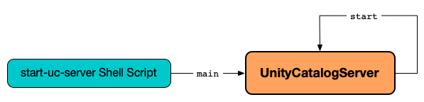

# UnityCatalogServer &mdash; Localhost Reference Server

`UnityCatalogServer` is Unity Catalog's **Localhost Reference Server**.

`UnityCatalogServer` can be started as a command-line application using the [bin/start-uc-server](index.md#start-uc-server) shell script.

```text
$ ./bin/start-uc-server
###################################################################
#  _    _       _ _            _____      _        _              #
# | |  | |     (_) |          / ____|    | |      | |             #
# | |  | |_ __  _| |_ _   _  | |     __ _| |_ __ _| | ___   __ _  #
# | |  | | '_ \| | __| | | | | |    / _` | __/ _` | |/ _ \ / _` | #
# | |__| | | | | | |_| |_| | | |___| (_| | || (_| | | (_) | (_| | #
#  \____/|_| |_|_|\__|\__, |  \_____\__,_|\__\__,_|_|\___/ \__, | #
#                      __/ |                                __/ | #
#                     |___/                        v0.5.0  |___/  #
###################################################################
```

`UnityCatalogServer` command-line application starts the [Unity Catalog API services](#addServices) (with the Armeria documentation service at http://localhost:8080/docs).

<figure markdown="span">
  { loading=lazy }
</figure>

## Launch UnityCatalogServer Command-Line Application { #main }

```java
void main(
  String[] args)
```

`main` is the entry point of [bin/start-uc-server](index.md#start-uc-server) shell script.

`main` performs the following steps in order:

1. [Creates an `OptionParser`](OptionParser.md) to parse the command-line options (`args`).
2. [Creates a `UnityCatalogServer.Builder`](#builder) and sets its [port](UnityCatalogServer.Builder.md#port) to the value of the [`--port` option](OptionParser.md#port) incremented by `1`.
3. Requests the `UnityCatalogServer.Builder` to [build a `UnityCatalogServer` instance](UnityCatalogServer.Builder.md#build)
4. [Prints the welcome ASCII art message](#printArt).
5. [Starts the `UnityCatalogServer`](#start).
6. Creates a [URLTranscoderVerticle](URLTranscoderVerticle.md) bound to the following ports:

    Port | Role
    -|-
    `8080` or [`--port`](OptionParser.md#port) | Transcode port (inbound)
    `8081` or `--port + 1` | Service port (forwarded)

7. Deploys the `URLTranscoderVerticle` on a [non-clustered Vert.x instance]({{ vertx.api }}/io/vertx/core/Vertx.html).

## Create UnityCatalogServer.Builder { #builder }

```java
UnityCatalogServer.Builder builder()
```

`builder` creates a new [UnityCatalogServer.Builder](UnityCatalogServer.Builder.md).

??? note "Static Method"
    `builder` is a Java **class method** to be invoked without a reference to a particular object.

    Learn more in the [Java Language Specification]({{ java.spec }}/jls-8.html#jls-8.4.3.2).

---

`builder` is used when:

* `UnityCatalogServer` is [launched as a command-line application](#main)

## Metastore

`UnityCatalogServer` [runs](#start) with a single metastore only that [can be created unless available already](../persistent-storage/MetastoreRepository.md#initMetastoreIfNeeded).

The summary of the single metastore is available through [MetastoreService](MetastoreService.md) at `/api/2.1/unity-catalog/` URL.

## Configuration Files

`UnityCatalogServer` uses the following configuration files:

* `etc/conf/server.log4j2.properties`
* [etc/conf/server.properties](ServerProperties.md)

## Server

`UnityCatalogServer` [builds a Server](#initializeServer) when [created](#creating-instance).

### initializeServer { #initializeServer }

```java
Server initializeServer(
  UnityCatalogServer.Builder unityCatalogServerBuilder)
```

`initializeServer` creates a `Server` ([Armeria]({{ armeria.api }}/com/linecorp/armeria/server/Server.html)) that listens on the [port](UnityCatalogServer.Builder.md#port) (of the given [UnityCatalogServer.Builder](UnityCatalogServer.Builder.md)).

`initializeServer`...FIXME

## SecurityContext { #securityContext }

`UnityCatalogServer` creates a [SecurityContext](../server-authorization/SecurityContext.md) when [created](#creating-instance) as follows:

Property | Value
-|-
 [Configuration Directory](../server-authorization/SecurityContext.md#configurationFolder) | `etc/conf`
 [securityConfiguration](../server-authorization/SecurityContext.md#securityConfiguration) | [SecurityConfiguration](#securityConfiguration)
 [Service Name](../server-authorization/SecurityContext.md#serviceName) | `server`
 [Local Issuer](../server-authorization/SecurityContext.md#localIssuer) | `internal`

This `SecurityContext` is used to create an [AuthService](AuthService.md).

## Creating Instance

`UnityCatalogServer` takes the following to be created:

* <span id="unityCatalogServerBuilder"> [UnityCatalogServer.Builder](UnityCatalogServer.Builder.md)

While being created, `UnityCatalogServer` does the following:

1. Initializes the [logging](#logging) (using `etc/conf/server.log4j2.properties` configuration file).
2. [Sets the default values for the port and server properties](#setDefaults) (unless set).
3. Initializes this [securityContext](#securityContext), [serverProperties](#serverProperties) and [server](#server)

??? note "Review"
    While being created, `UnityCatalogServer` builds the [Server](#server):

    1. Handle HTTP requests at the given [port](#port)
    2. Bind the Armeria documentation service ([Armeria]({{ armeria.api }}/com/linecorp/armeria/server/docs/DocService.html)) under `/docs` URL
    3. [Register the API services](#addServices)

`UnityCatalogServer` is created when:

* `UnityCatalogServer` command-line utility is [started](#main)

### setDefaults { #setDefaults }

```java
void setDefaults(
  UnityCatalogServer.Builder unityCatalogServerBuilder)
```

`setDefaults` sets the [port](UnityCatalogServer.Builder.md#port) and [serverProperties](UnityCatalogServer.Builder.md#serverProperties) to their default values unless defined:

Property | Default
-|-
 [port](UnityCatalogServer.Builder.md#port) | `8080`
 [serverProperties](UnityCatalogServer.Builder.md#serverProperties) | `etc/conf/server.properties`

### initializeServer { #initializeServer }

```java
Server initializeServer(
  UnityCatalogServer.Builder unityCatalogServerBuilder)
```

`initializeServer`...FIXME

### addApiServices { #addApiServices }

```java
void addApiServices(
  ServerBuilder armeriaServerBuilder,
  UnityCatalogServer.Builder unityCatalogServerBuilder,
  ServerProperties serverProperties,
  UnityCatalogAuthorizer authorizer,
  Repositories repositories)
```

`addApiServices`...FIXME

### addDeltaApiServices { #addDeltaApiServices }

```java
void addDeltaApiServices(
  ServerBuilder armeriaServerBuilder,
  UnityCatalogAuthorizer authorizer,
  Repositories repositories,
  ServerProperties serverProperties,
  StorageCredentialVendor storageCredentialVendor)
```

`addDeltaApiServices`...FIXME

## Register API Services { #addServices }

```java
void addServices(
  ServerBuilder sb)
```

`addServices` initializes an authorizer based on [server.authorization](../server-authorization/index.md#server.authorization) configuration property.
When enabled (`enable`), `addServices` creates a [JCasbinAuthorizer](../server-authorization/JCasbinAuthorizer.md) and [initializes the admin user](../server-authorization/UnityAccessUtil.md#initializeAdmin). Otherwise, `addServices` creates an [AllowingAuthorizer](../server-authorization/AllowingAuthorizer.md).

`addServices` creates and registers Unity Catalog API services at the `/api/2.1/unity-catalog/` base path.

URL | Service
-|-
 `/` | Returns `Hello, Unity Catalog!` message
 `/api/1.0/unity-control/auth` |  [AuthService](AuthService.md)
 `/api/1.0/unity-control/scim2/Me` |  [Scim2SelfService](Scim2SelfService.md)
 `/api/1.0/unity-control/scim2/Users` |  [Scim2UserService](Scim2UserService.md)
 `/api/2.1/unity-catalog/` | [MetastoreService](MetastoreService.md)
 `/api/2.1/unity-catalog/catalogs` | [CatalogService](CatalogService.md)
 `/api/2.1/unity-catalog/functions` | [FunctionService](FunctionService.md)
 `/api/2.1/unity-catalog/iceberg` | [IcebergRestCatalogService](../iceberg/IcebergRestCatalogService.md)
 `/api/2.1/unity-catalog/models` | [ModelService](ModelService.md)
 `/api/2.1/unity-catalog/permissions` | [PermissionService](PermissionService.md)
 `/api/2.1/unity-catalog/schemas` | [SchemaService](SchemaService.md)
 `/api/2.1/unity-catalog/tables` | [TableService](TableService.md)
 `/api/2.1/unity-catalog/temporary-model-version-credentials` | [TemporaryModelVersionCredentialsService](TemporaryModelVersionCredentialsService.md)
 `/api/2.1/unity-catalog/temporary-path-credentials` | [TemporaryPathCredentialsService](TemporaryPathCredentialsService.md)
 `/api/2.1/unity-catalog/temporary-table-credentials` | [TemporaryTableCredentialsService](TemporaryTableCredentialsService.md)
 `/api/2.1/unity-catalog/temporary-volume-credentials` | [TemporaryVolumeCredentialsService](TemporaryVolumeCredentialsService.md)
 `/api/2.1/unity-catalog/volumes` | [VolumeService](VolumeService.md)

With [server.authorization](../server-authorization/index.md#server.authorization) configuration property enabled, `addServices` prints out the following INFO message to the logs:

``` text
Authorization enabled.
```

`addServices` registers HTTP service decorators.

HTTP Service Decorator | Path Prefix
-|-
[UnityAccessDecorator](../server-authorization/UnityAccessDecorator.md) | <ul><li>`/api/2.1/unity-catalog/`<li>`/api/1.0/unity-control/` (except `/api/1.0/unity-control/auth/tokens`)</ul>
[AuthDecorator](../server-authorization/AuthDecorator.md) | <ul><li>`/api/2.1/unity-catalog/`<li>`/api/1.0/unity-control/` (except `/api/1.0/unity-control/auth/tokens`)</ul>

## Start Server { #start }

```java
void start()
```

`start` prints out the following INFO message to the logs:

```text
Starting server...
```

`start` requests the [MetastoreRepository](../persistent-storage/MetastoreRepository.md) to [initMetastoreIfNeeded](../persistent-storage/MetastoreRepository.md#initMetastoreIfNeeded).

`start` requests this [Server](#server) to start and listen to the defined ports.

`start` waits until this `Server` is fully started up.

---

`start` is used when:

* `UnityCatalogServer` is [launched on command line](#main)

## Logging

Enable `ALL` logging level for `io.unitycatalog.server.UnityCatalogServer` logger to see what happens inside.

Add the following line to `etc/conf/server.log4j2.properties`:

```text
logger.UnityCatalogServer.name = io.unitycatalog.server.UnityCatalogServer
logger.UnityCatalogServer.level = all
```

Refer to [Logging](../logging.md).
